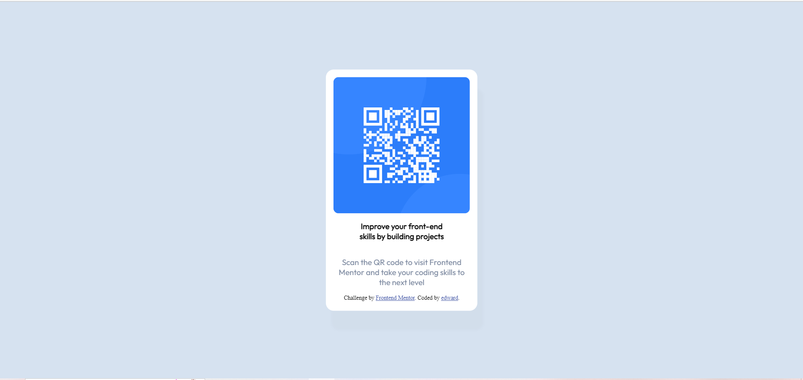

# Frontend Mentor - QR code component solution

## Table of contents
- [Overview](#overview)
  - [Screenshot](#screenshot)
  - [Links](#links)
  - [Built with](#built-with)
  - [What I learned](#what-i-learned)
  - [Continued development](#continued-development)
  - [Useful resources](#useful-resources)
- [Author](#author)

## Overview
Desafío completado el cual consistía en la replicación de una de un sitio web que contenía una imagen QR con una breve descripción
### Screenshot

### Links

- Solution URL: [Add solution URL here](https://edwardlopez414.github.io/Componente_de_codigo-QR/)

### Built with

- Semantic HTML5 markup
- CSS custom properties
- Flexbox
- Mobile-first workflow
### What I learned

 Aprendí a utilizar la etiqueta br 

   
Scan the QR code to
        visit Frontend  
        Mentor and take your coding skills to   
        the next level 
      

### Continued development

Me gustaría perfeccionar mis conocimientos en css, ya que me siento aún muy deficiente en este ámbito

### Useful resources

- [resource 1](https://developer.mozilla.org/es/docs/Web/HTML/Element/br) - me ayudo a entender el funcionamiento de la etiqueta br

## Author

- Frontend Mentor - [@yourusername](https://www.frontendmentor.io/profile/edwardlopez414)
*
